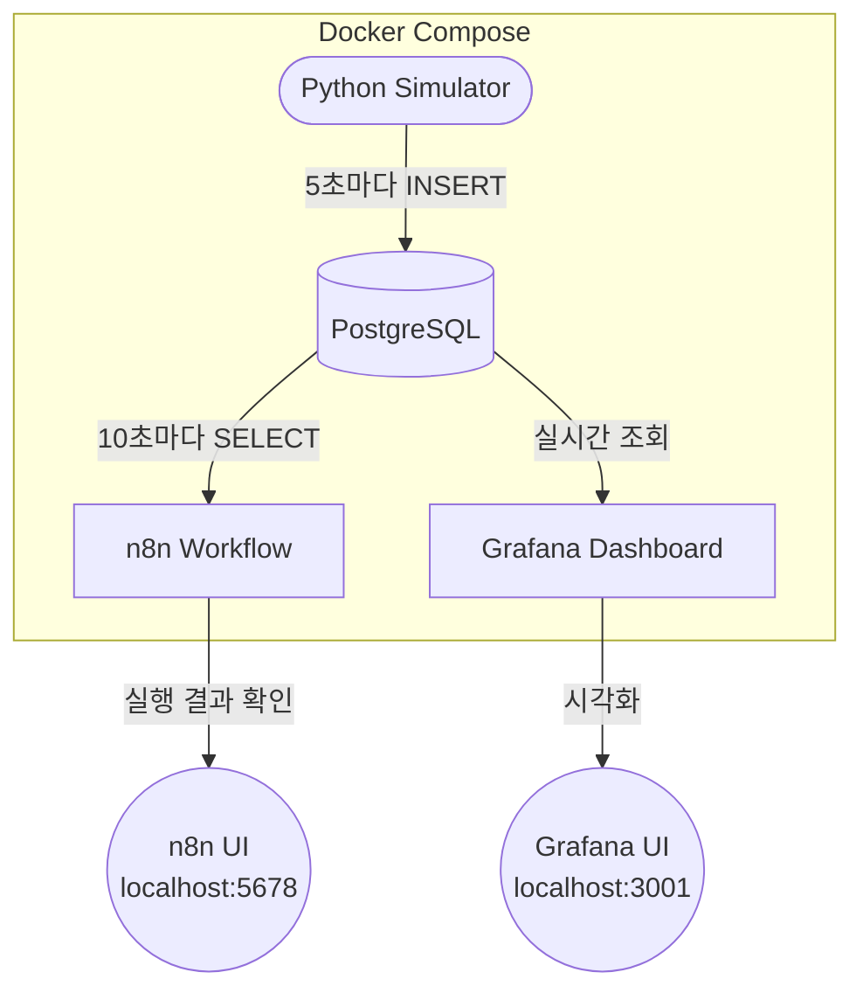
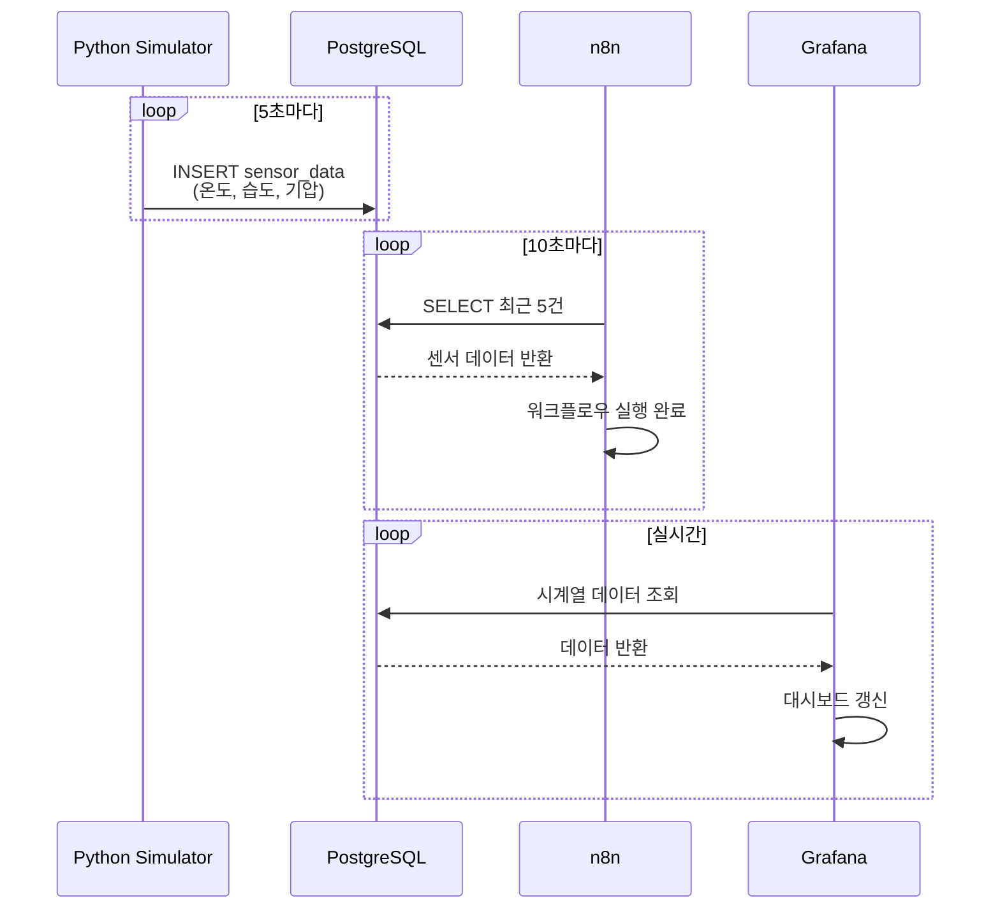

# Docker Sensor Dashboard

Docker Compose로 구성한 센서 데이터 수집 및 모니터링 시스템입니다.
Python이 가상 센서 데이터를 생성하고, PostgreSQL에 저장하며, n8n 워크플로우로 자동 처리하고 Grafana로 시각화합니다.

---

## 시스템 구성도



---

## 데이터 흐름



---

## 서비스 구성

| 서비스 | 이미지 | 포트 | 역할 |
|--------|--------|------|------|
| `postgresql` | postgres:15 | 5433 | 센서 데이터 저장 |
| `python-simulator` | python:3.11-slim | - | 가상 센서 데이터 생성 |
| `n8n` | n8nio/n8n | 5678 | 워크플로우 자동화 |
| `grafana` | grafana/grafana | 3001 | 데이터 시각화 |

---

## 센서 데이터

| 항목 | 범위 | 단위 |
|------|------|------|
| 온도 | 15.0 ~ 35.0 | °C |
| 습도 | 30.0 ~ 90.0 | % |
| 기압 | 980.0 ~ 1025.0 | hPa |

---

## 실행 방법

### 1. 환경변수 파일 생성

프로젝트 루트에 `.env` 파일을 생성합니다.

```env
POSTGRES_DB=sensordb
POSTGRES_USER=sensor_user
POSTGRES_PASSWORD=sensor_pass

GF_SECURITY_ADMIN_USER=admin
GF_SECURITY_ADMIN_PASSWORD=admin
```

### 2. 컨테이너 실행

```bash
docker compose up -d
```

### 3. 서비스 접속

| 서비스 | URL |
|--------|-----|
| n8n | http://localhost:5678 |
| Grafana | http://localhost:3001 |

### 4. n8n PostgreSQL 연동

1. `http://localhost:5678` 접속 후 계정 생성
2. **Credentials → Add Credential → PostgreSQL** 선택
3. 아래 정보 입력:
   - Host: `postgresql`
   - Port: `5432`
   - Database: `sensordb`
   - User: `sensor_user`
   - Password: `sensor_pass`
4. **Workflows → Import** → `n8n/workflow.json` 업로드
5. 워크플로우 **Activate**

### 5. 컨테이너 종료

```bash
docker compose down
```

---

## 프로젝트 구조

```
.
├── docker-compose.yml
├── .env                        # 환경변수 (git 제외)
├── postgresql/
│   └── init.sql                # 테이블 초기화 스크립트
├── python/
│   ├── Dockerfile
│   └── sensor_simulator.py     # 센서 데이터 생성기
├── n8n/
│   └── workflow.json           # n8n 워크플로우 (임포트용)
└── grafana/
    ├── dashboards/
    │   └── sensor.json         # 대시보드 정의
    └── provisioning/
        ├── dashboards/
        │   └── dashboard.yml
        └── datasources/
            └── postgresql.yml  # 데이터소스 자동 설정
```
